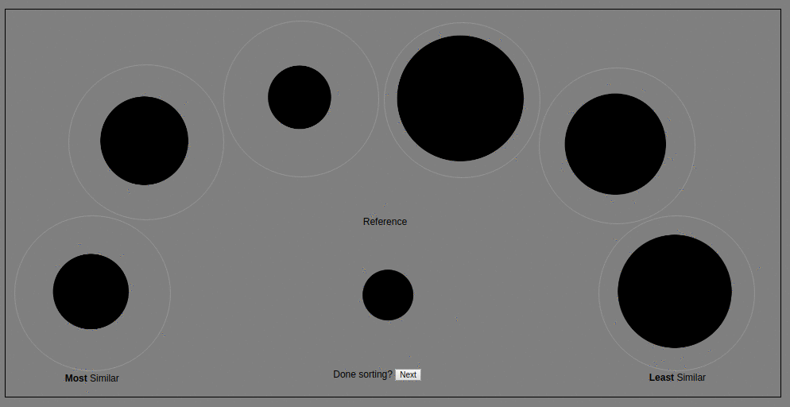

# Perceptual Similarity Sorting Experiment

This web page is a more detailed description of the [online perceptual similarity sorting experiment](http://168.61.15.87/sorting_welcome.html).

## Summary

The online perceptual similarity sorting experiment is a collaboration between [HP Labs](http://www8.hp.com/us/en/hp-labs/research/overview.html) and the [University of Minnesota](https://www-users.cs.umn.edu/~gmeyer/). The experiment is an extension of a [2017 summer intern project](https://newsblog.ext.hp.com/t5/HP-newsroom-blog/Summer-2017-interns-at-HP-Labs-Michael-Ludwig/ba-p/995) and builds on results to be presented at the [Materials 2018](http://www.imaging.org/site/IST/IST/Conferences/EI/EI_2018/Conference/C_MAAP.aspx) conference of the [Electronic Imaging Symposium](http://www.imaging.org/site/IST/IST/Conferences/EI/Symposium_Overview.aspx). The research topic is the perception of complex visual appearance in the context of 3D printing. The HP Labs contributors are Nathan Moroney, Dr. Ingeborg Tastl, Melanie Gottwals and Gary Dispoto. The University of Minnesota contributors are Dr. Gary Meyer and Michael Ludwig. 

## Sorting Experiment

The sorting experiment consists of six items to be sorted relative to a reference item. The items are arranged in an arc, with the reference in the center. The task is to sort all items from most similar, on the left, to least similar, on the right. The above animated loop shows an example of a participant sorting items by size to demonstrate the task. The experiment begins with two test trials, a shape sorting task and a solid color sorting task. The two test trials are followed by five complex appearance sorting trails. These trials consist of blobs whose appearance has been programmatically modified. The details of the modifications will be documented here after the initial data collection period. The appearance modifications made use of [Appearance Exchange Format](https://www.xrite.com/categories/formulation-and-quality-assurance-software/appearance-exchange-format-axf) data collected by the X-Rite [TAC7 material appearance scanner](https://www.xrite.com/categories/appearance/total-appearance-capture-ecosystem/tac7). The blob shape is one of the 3D models in the [Pantora™](https://www.xrite.com/categories/appearance/total-appearance-capture-ecosystem/pantora-software) software and was created by [Prof. Roland Fleming](http://www.allpsych.uni-giessen.de/roland/). As additional examples of uses of visual sorting, refer to the [Farnsworth-Munsell 100 hue test](https://en.wikipedia.org/wiki/Farnsworth-Munsell_100_hue_test) or our earlier study of [large color differences](https://github.com/NMoroney/public/blob/master/docs/papers/cic22-large_color_differences.pdf).

The experiment is implemented as basic JavaScript, but uses HTML5 drag-and-drop and web storage functionality. Achieving circular drag and drop regions makes use of the [suggestion](https://www.telerik.com/forums/drag-and-drop-in-circular-div-target-area) to use the `border-radius` property. The experiment makes use of a temporary, anonymous user identifier to keep track of each participants sortings. The identifier is deleted at the end of the experiment and is used as an anonymous key to facilitate analysis. The experiment collects the following data:

* the initial (randomized) order of images
* the user sorting
* the drag and drop history for each sorting
* the time history for each sorting
* the date and time
* the display width and height in pixels

No other data is collected. The drag and drop sequence and times is recorded as another data source for potentially analyzing uncertainty in the sorting. The display properties are recorded to assess how well the default scale used for the stimuli, in pixels, for the data collected. The experiment is completely voluntary and participants may quit at any time. The authors are grateful to the volunteers who participated in the experiment.

## Questions-and-Answers

Follow-up to questions from participants of the experiment, in no particular order.

### Q: Why an arc layout?

A: We tested a couple other layouts, including a linear arrangement. But the arc layout allows the reference to be display approximately equi-distant from the items being sorted. Using an arc layout also allowed the items and reference to be larger in terms of pixel dimensions than any of the linear layouts that we tested.

### Q: How are the blobs being processed in the last five trials?

A: This will be documented in a manuscript that is currently being written. In order to reduce effects or bias of any participants reading this page before doing the experiment, the specific programmatic adjustments will not be described until after an initial period of data collection.

### Q: How is the data being collected and logged?

A: The back-end of the program is a relatively minimal Python script that parses the form, performs light weight data cleaning and appends to a text file. All of this is performed using a cloud service to host the experiment and the script.

### Q: Will you be publishing the data collected?

A: After analysis and confidence that the data has utility for research applications, yes the volunteer data will be published to this repository.

### Q: Why sorting? Why not paired comparison or other technique?

A: We previously used sorting for a web-based [large color difference study](https://github.com/NMoroney/public/blob/master/docs/papers/cic22-large_color_differences.pdf) but wanted to revisit the topic given that previously all of the stimuli were intended to have the same computational or model difference while observers sorting them in a manner that was not random. In this case we have not generated stimuli that have equal model differences.

## References

1. Moroney, Nathan, Ingeborg Tastl, and Melanie Gottwals. ["A Similarity Measure for Large Color Differences."](https://github.com/NMoroney/public/blob/master/docs/papers/cic22-large_color_differences.pdf) Color and Imaging Conference. Vol. 2014. No. 2014. Society for Imaging Science and Technology, 2014.
2. Ludwig, Michael, and Gary Meyer. "Brightness Perception of Surfaces with Mesoscale Structures." Journal of Imaging Science and Technology 61.2 (2017): 20504-1.
3. Roland W. Fleming, Ron O. Dror, and Edward H. Adelson. 2003. Real-world illumination and the perception of surface reflectance properties. Journal of Vision 3, 5 (June 2003), 347–368.
4. Cliff, Norman. [Ordinal methods for behavioral data analysis.](https://searchworks.stanford.edu/view/3431365) Psychology Press, 2014.
5. [Farnsworth-Munsell 100 hue test](https://en.wikipedia.org/wiki/Farnsworth-Munsell_100_hue_test).
6. David Bimler and John Kirkland, ["Perceptual Modelling of Product Similarities Using Sorting Data"](http://marketing-bulletin.massey.ac.nz/V9/MB_V9_A2_Bimler.pdf). Marketing Bulletin, 9, pp. 16-27 (1998). Note Figure 4, which is a perceptual map or MDS result for canned (or tinned) beers.
7. Rogowitz, Bernice E., et al. ["Perceptual image similarity experiments."](https://pdfs.semanticscholar.org/be12/2326c3e1b5f2375023442573a5a45ce8b75c.pdf) Human Vision and Electronic Imaging. Vol. 3. No. 3299. 1998. In this experiment a full 2D sort of 97 printed images.
8. Clarke, Alasdair DF, Xinghui Dong, and Mike J. Chantler. ["Does free-sorting provide a good estimate of visual similarity."](http://www.perceptions.macs.hw.ac.uk/papers/Does_Free-sorting_Provide_a_Good_Estimate_of_Visual_Similarity.pdf) Predicting Perceptions (2012): 17-20. Free-sorting of 334 texture images by 30 participants.

## Acknowldegments

* [Prof. Roland Fleming](http://www.allpsych.uni-giessen.de/roland/) created the blob object 
* [X-Rite](https://www.xrite.com/) developed the [Appearance Exchange Format](https://www.xrite.com/categories/formulation-and-quality-assurance-software/appearance-exchange-format-axf) and [TAC7 material apperance scanner](https://www.xrite.com/categories/appearance/total-appearance-capture-ecosystem/tac7) used in this research.

## To Do

Also to be done:

* more complete browser compatibility matrix

