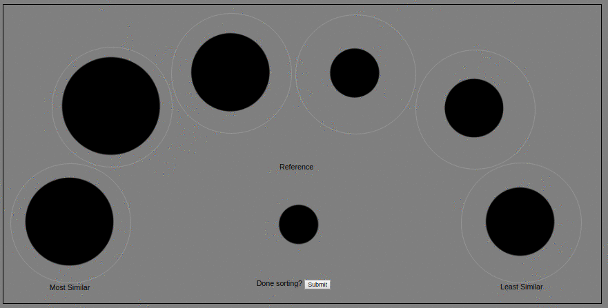

# Perceptual Similarity Sorting Experiment

This web page is a more detailed description of the online perceptual similarity sorting experiment.

## Summary

The online perceptual similarity sorting experiment is a collaboration between [HP Labs](http://www8.hp.com/us/en/hp-labs/research/overview.html) and the [University of Minnesota](https://www-users.cs.umn.edu/~gmeyer/). The experiment is an extension of a [2017 summer intern project](https://newsblog.ext.hp.com/t5/HP-newsroom-blog/Summer-2017-interns-at-HP-Labs-Michael-Ludwig/ba-p/995) and builds on results to be presented at the [Materials 2018](http://www.imaging.org/site/IST/IST/Conferences/EI/EI_2018/Conference/C_MAAP.aspx) conference of the [Electronic Imaging Symposium](http://www.imaging.org/site/IST/IST/Conferences/EI/Symposium_Overview.aspx). The research topic is the perception of complex visual appearance in the context of 3D printing. The HP Labs contributors are Nathan Moroney, Dr. Ingeborg Tastl, Melanie Gottwals and Gary Dispoto. The University of Minnesota contributors are Dr. Gary Meyer and Michael Ludwig. 

## Sorting Experiment

The sorting experiment consists of six items to be sorted relative to a reference item. The items are arranged in an arc, with the reference in the center. The task is to sort all items from most similar, on the left, to least similar, on the right. The above animated loop shows an example of a partcipant sorting items by size to demonstrate the task. The experiment begins with two test trials, a shape sorting task and a solid color sorting task. The two test trials are followed by five complex appearance sorting trails. These trials consist of blobs whose appearance has been programmatically modified. The details of the modifications will be documented here after the initial data collection period. The appearance modifications made use of [Appearance Exchange Format](https://www.xrite.com/categories/formulation-and-quality-assurance-software/appearance-exchange-format-axf) data collected by the X-Rite [TAC7 material apperance scanner](https://www.xrite.com/categories/appearance/total-appearance-capture-ecosystem/tac7). The blob shape is one of the 3D models in the [Pantora™](https://www.xrite.com/categories/appearance/total-appearance-capture-ecosystem/pantora-software) software and was created by [Prof. Roland Fleming](http://www.allpsych.uni-giessen.de/roland/). As an additional example of a visual sorting task, refer to the [Farnsworth-Munsell 100 hue test](https://en.wikipedia.org/wiki/Farnsworth-Munsell_100_hue_test).

The experiment is implemented as basic JavaScript, but uses HTML5 drag-and-drop and web storage functionality. Achieving circular drag and drop regions makes use of the [suggestion](https://www.telerik.com/forums/drag-and-drop-in-circular-div-target-area) to use the `border-radius` property. The experiment makes use of a temporary user identifier to keep track of each participants sortings. The identifier is deleted at the end of the experiment and is used as an anonymous key to facilitate analysis. The experiment collects the following data:

* the initial (randomized) order of images
* the user sorting
* the drag and drop history for each sorting
* the time history for each sorting
* the date and time
* the display width and height in pixels

No other data is collected. The drag and drop sequence and times is recorded as another data source for potentially analyzing uncertainty in the sorting. The display properties are recorded to assess how well the default scale used for the stimuli, in pixels, for the data collected. The experiment is completely voluntary and participants may quit at any time. The authors are grateful to the volunteers who partipated in the experiment.

## To Do

Also to be done:

* link to EI paper & large color differences experiment (which aslo used sorting)
* references section
* questions / answers section
* acknowledgements 
* add link back to the experiment

